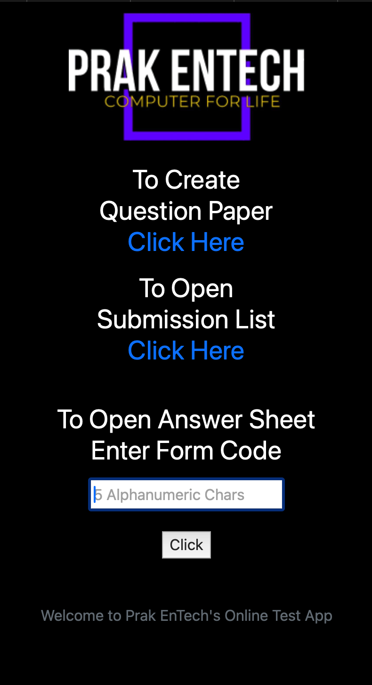
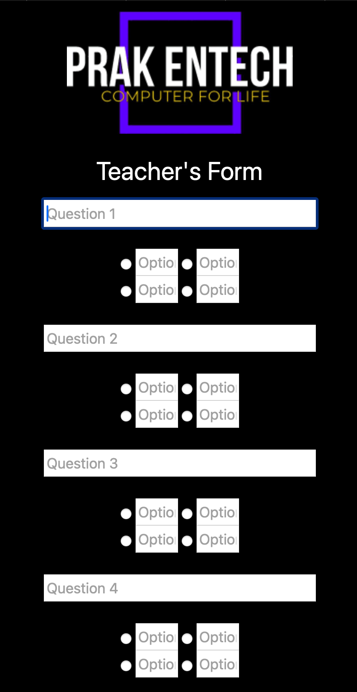
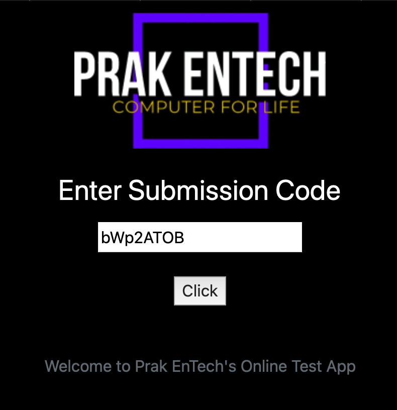

# Online Examination Web App

This project is an online test web application developed using Flask. It allows teachers to create multiple-choice question papers with 10 questions. Teachers receive two unique codes: one for sharing with students to take the test and the other for teachers to review submissions. After students submit their responses, their scores are calculated and stored in a record that teachers can access.

## Features

- **Create Question Paper:** Teachers can create a question paper with 10 multiple-choice questions.
- **Unique Codes:** Generate two unique codes—one for students to access the test and one for teachers to check submissions.
- **Student Submission:** Students can submit their answers using the provided code.
- **Automatic Scoring:** The app automatically calculates the student's score upon submission.
- **Submission Records:** Teachers can review all submissions and scores using the unique teacher code.

## Flask Routes

- `/`: Home page
- `/teacher`: Page for teachers to input questions
- `/submission`: Submission form for students
- `/teacher/fill`: Handles the creation of the question paper and generates unique codes
- `/formsubmit`: Processes student submissions and displays the test
- `/formresult`: Calculates and displays the student's score
- `/checksubmissions`: Allows teachers to view all student submissions

## Installation

1. Clone this repository:
   ```bash
   git clone https://github.com/PrakEntech/Online-Examination-Web-Flask-.git
   ```
2. Navigate to the project directory:
   ```bash
   cd Online-Examination-Web-Flask-
   ```
3. Install Flask:
   ```bash
   pip install flask
   ```
4. Run the Flask application:
   ```bash
   python flask_app.py
   ```

## Usage

- Teachers can visit `/teacher` to create the question paper and get the unique codes.
- Students can use the code at `/submission` to answer the questions.
- After submission, the teacher can check the records at `/checksubmissions`.

## Screenshots
<p align="center">



   <p align="top">
      
   </p>
</p>

## Contact

For any questions or suggestions, feel free to reach out at [PrakEnTech](mailto:prakhartech983@gmail.com).
